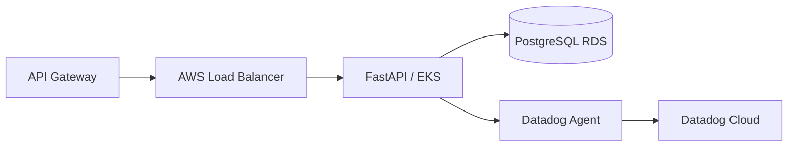

# Oficina API — FIAP Tech Challenge Fase 3

Aplicação principal em FastAPI executada no Amazon EKS. Consome JWT emitido pela Lambda de autenticação por CPF, persiste dados no PostgreSQL RDS e envia logs, métricas e traces ao Datadog.

## Stack

Python 3.13, FastAPI, SQLAlchemy, PostgreSQL, Docker, Kubernetes/EKS, HPA, Amazon ECR, Datadog, Prometheus/OpenMetrics e GitHub Actions.

## Arquitetura específica



Documentação completa: [docs/ARQUITETURA.md](docs/ARQUITETURA.md).

## Execução local

```bash
python -m venv .venv
source .venv/bin/activate
pip install -r requirements-dev.txt
uvicorn app.main:app --reload
```

Swagger local: `http://localhost:8000/docs`

## Testes

```bash
pytest --cov=app --cov-report=term-missing
```

## Docker

```bash
docker build -t oficina-api .
docker run --rm -p 8000:8000 --env-file .env oficina-api
```

## Kubernetes

O diretório `k8s/` contém:

- Namespace `oficina`;
- Deployment com requests/limits e probes;
- Service `LoadBalancer`;
- HPA por CPU e memória;
- NetworkPolicy;
- configuração de autodiscovery Datadog/OpenMetrics.

## Segurança

Rotas `/api/v1/*` exigem `Authorization: Bearer <JWT>`. O JWT é emitido pela Lambda após validação do CPF e do status do cliente. A aplicação valida assinatura, issuer e expiração antes de processar a requisição.

## Observabilidade

A aplicação implementa:

- logs JSON estruturados;
- `x-correlation-id`;
- traces FastAPI via Datadog APM;
- métricas HTTP e latência;
- volume de OS;
- erros de integração;
- transições e tempo por status.

Detalhes: [docs/OBSERVABILIDADE.md](docs/OBSERVABILIDADE.md).

## CI/CD

Pull Requests executam testes, coverage e Docker build. Push/execução manual autorizada:

1. cria/valida o repositório ECR;
2. faz build e push da imagem;
3. lê DATABASE_URL e JWT_SECRET do AWS Secrets Manager;
4. cria/atualiza o Kubernetes Secret;
5. aplica os manifests;
6. aguarda rollout e Load Balancer;
7. executa smoke test em `/health`;
8. publica Swagger/health/backend URLs no Summary.

Variável necessária para deploy: `ENABLE_DEPLOY=true`.

## Swagger / Postman

Após o deploy, o pipeline publica `SWAGGER_URL` no Summary.

Coleção Postman: [postman/Oficina-Fase3.postman_collection.json](postman/Oficina-Fase3.postman_collection.json).

## Documentação da entrega

- [Índice da entrega](ENTREGA_FASE3.md)
- [Arquitetura](docs/ARQUITETURA.md)
- [RFC Cloud](docs/RFC-001-ARQUITETURA-CLOUD.md)
- [RFC Modelo de Dados](docs/RFC-002-MODELO-DADOS.md)
- [ADR HPA](docs/ADR-001-HPA.md)
- [ADR Observabilidade](docs/ADR-002-OBSERVABILIDADE.md)
- [Roteiro do vídeo](docs/VIDEO-ROTEIRO.md)
