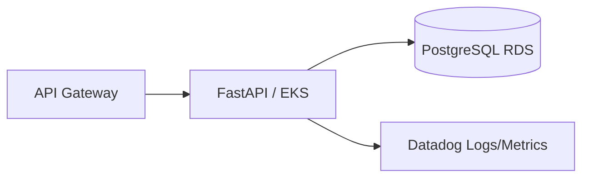

# Oficina API - Fase 3

Aplicação principal FastAPI executada em Kubernetes. Consome JWT emitido pela Lambda de autenticação por CPF e expõe métricas, healthchecks e logs JSON correlacionados.

## Arquitetura específica


## Execução local
```bash
python -m venv .venv && source .venv/bin/activate
pip install -r requirements-dev.txt
uvicorn app.main:app --reload
```

Swagger: `http://localhost:8000/docs`

## Testes
```bash
pytest --cov=app --cov-report=term-missing
```

## Docker
```bash
docker build -t oficina-api .
docker run --rm -p 8000:8000 --env-file .env oficina-api
```

## CI/CD
PR para `main`: lint, testes, coverage e Docker build. Push em `hml`/`main`: build e push ECR + deploy automático EKS.
