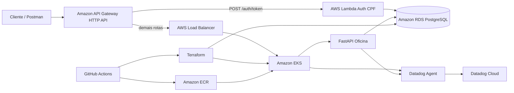
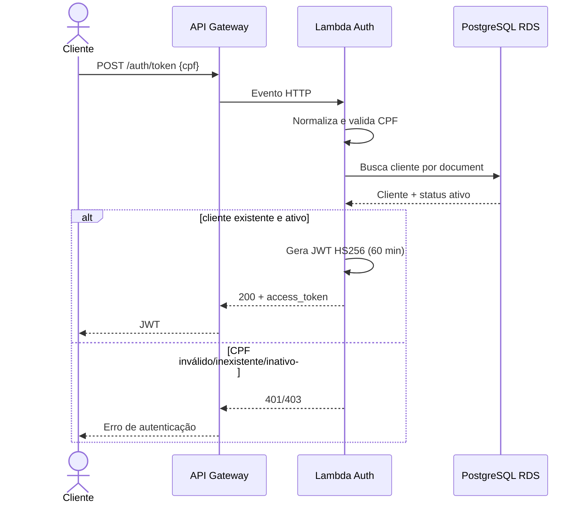
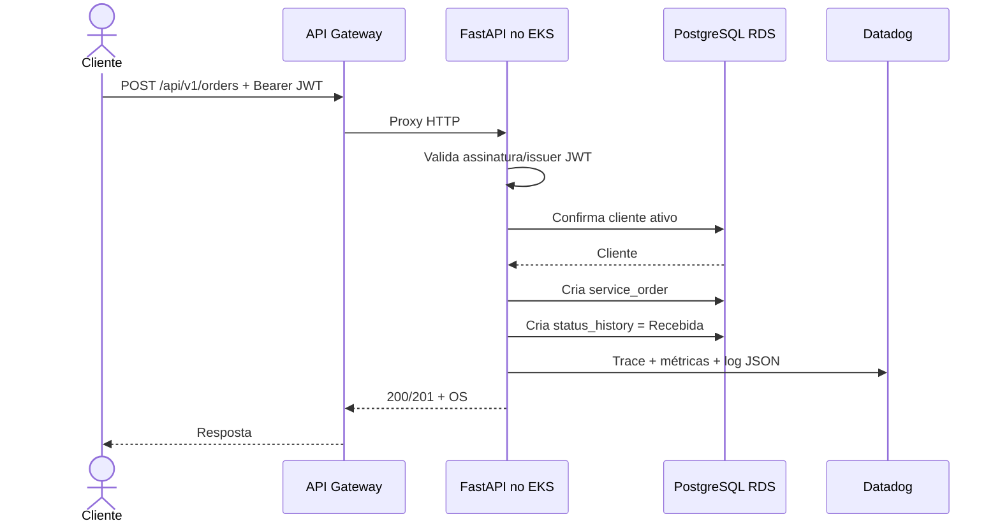

# Arquitetura — Tech Challenge Fase 3

## Visão de componentes

## Fluxo de autenticação por CPF

## Fluxo de abertura de Ordem de Serviço

## Decisões principais

- API Gateway é o ponto de entrada público e separa o fluxo serverless de autenticação do backend Kubernetes.
- A Lambda valida CPF, existência e situação do cliente e emite JWT.
- A aplicação FastAPI valida o JWT novamente nas rotas sensíveis.
- PostgreSQL é privado na VPC; Lambda e workloads do EKS acessam o banco pela rede da VPC.
- EKS executa a aplicação com requests/limits, probes e HPA.
- Logs são JSON e carregam `x-correlation-id`; métricas e traces são enviados ao Datadog.
- Terraform mantém infraestrutura reprodutível e o state é persistido em S3 versionado e criptografado.
