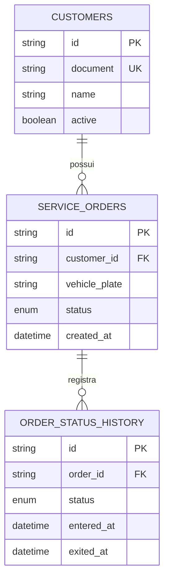

# RFC-002 — Evolução do modelo de dados

## Status
Aceita.

## Problema
Somente o status atual da Ordem de Serviço não permite responder quanto tempo uma OS permaneceu em cada etapa. Esse dado é necessário para identificar gargalos e alimentar o dashboard de tempo médio por status.

## Decisão
Manter o modelo relacional PostgreSQL e adicionar a entidade `order_status_history`.

## Justificativa
`service_orders.status` continua sendo a leitura rápida do estado corrente. `order_status_history` preserva cada transição, permitindo calcular duração por etapa sem sobrecarregar o registro principal da OS.

A duração de uma etapa concluída é `exited_at - entered_at`. A etapa corrente mantém `exited_at = NULL`.

## Consequências
O modelo passa a suportar análise operacional, tempo médio por status, investigação de gargalos e auditoria da evolução da OS. A aplicação atualiza o registro corrente e o histórico dentro da mesma transação.
